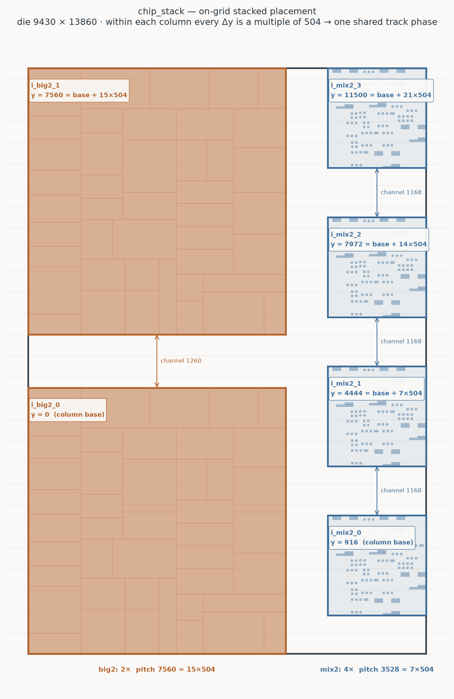

# flow/chip — the next-level hier vehicle

Three instances each of **big2** (the flat `tc3b_flat_x5.buda` script as a
cell) and **mix2** (the hierarchical `flow/rnr/mix2.bdb.sql` imported as a BDB
cell — `build_hier_demo`'s one-level flatten), SA-placed with 25% bloat
channels, plus **100** random cross-instance top buses:
6 instances, 432 leaf blocks, 13320 nets — the largest corpus vehicle.

Generator (deterministic — fixed seed + iteration budget, no wall-clock)
===
```
python3 tools/build_hier_demo.py chip.bdb \
    --cells big2=flow/big_data_test/big2/tc3b_flat_x5.buda,mix2=flow/rnr/mix2.bdb.sql \
    --instances 3 --buses 100 --optimize sa --param iter=60k --bloat 25%
python3 tools/bdb_serialize.py dump chip.bdb chip.bdb.sql
```

Repro
===
```
buda flow/chip/chip_topdown.buda      # plain hier pipeline, no healers
buda flow/chip/chip_bottomup.buda     # bottom-up templates + align_bottom_up
```

Both flows run WITHOUT healers for fast experimentation — add
`negotiate_congestion` / `ripup_reroute` / `refine_selection` rounds manually
when studying healing at this scale.  `chip_tracks.buda` is the shared
**10-layer** stack + track patterns: M2/M3 LOW plus eight TOP layers M4–M11,
each pair coarser than the one below it (M10/M11 use 3.25-wide signal wires on
10-wide rails).  It extends big2's `tracks4top.buda` / mix2's
`mix_tracks.buda` (identical 6-layer stacks) by four layers — chip is where
a realistic top-metal count pays.  Every unit is **mirror-symmetric** and
carries **ten** signal tracks per period; `chip_tracks_mirror.buda` is the same
patterns with three H origins moved so a mirrored placement keeps its track
phase, used by the two `chip_stack` vehicles.  See "A mirrored layout needs a
mirror-symmetric technology" and "The 8 → 10 track study" below.  The 6 → 8 → 10
layer study below is worth
reading before copying this stack: the first extension is a clean win, the
second is the diminishing-returns knee, and it exposed that a cap band
written for one stack height is wrong on another.

Baseline endpoints (2026-07-30, x86 reference build; both in the QoR corpus)
===
| Flow | overlaps | unplaced | viol_bundles | abstract WL | detailed WL | sec |
|---|---|---|---|---|---|---|
| chip_topdown | 255 | 3185 | 163 | 3036142 | 61969962 | 148 |
| chip_bottomup | 490 | 2285 | 110 | 2659098 | 46670260 | 130 |

(Refreshed 2026-07-31 after the `band_span_charge` default flip (#530) —
which helps this vehicle: topdown overlaps 452→255, bottomup unplaced
2610→2285 — and the planner-runtime fixes below, which cut the topdown
total 391s→148s.  The original 2026-07-30 baseline: topdown 452/3341/163
at 391s, bottomup 527/2610/136 at 187s.)

Top-layer count study — 6 → 8 → 10 layers (2026-08-01)
===
`chip_tracks.buda` was extended twice: first to eight layers (M8 H / M9 V
TOP, 3-wide wires on 8-wide rails, 57.14% overhead), then to ten (M10 H /
M11 V TOP, 4-wide wires on 10-wide rails, 56.76%).  Each pair is coarser
than the one below, as real top metal is — which is exactly what makes the
second extension behave differently from the first.

| Flow | 6 layers (ov/unpl/viol) | 8 layers | 10 layers |
|---|---|---|---|
| chip_topdown | 266 / 3307 / 159 | **164 / 2227 / 120** | 188 / 2170 / 112 |
| chip_topdown_aligned | — | 206 / 1914 / 113 | 193 / 2027 / 112 |
| chip_bottomup | 482 / 2205 / 105 | **397 / 1921 / 107** | **353 / 1604 / 91** |
| chip_bottomup_caps | 458 / 3131 / 126 | 442 / 2996 / 116 | **358 / 1708 / 93** † |
| chip3_topdown | 121 / 1731 / 133 | **88 / 1687 / 123** | **63 / 1639 / 118** |
| chip3_bottomup | — | 365 / 1623 / 93 | **311 / 1544 / 87** |
| chip3a_bottomup | 447 / 2269 / 103 | **354 / 1698 / 84** | 297 / 1658 / 90 |

† `chip_bottomup_caps` reads 424/3192/124 at ten layers if its bands are
left at the 6-layer `M3 M5`; the row above is the rescaled `M5 M9` the
vehicle now ships with — see the band discussion below.

**6 → 8 was a clean win**: 5 better / 0 worse, every flow improving on all
three metrics, abstract WL −1..−5%, and the sweep 23% faster because fewer
bundles grind through the escalation ladder.  The layers carry real
traffic — `chip_bottomup` put ~20% of its metal on M8/M9.

**8 → 10 is the diminishing-returns knee**: 5 better / 2 worse.  The cause
is the per-bit cost of coarse metal.  Each pair's channel cost per bit is
`unit_pitch / n_signal_slots`:

| layers | M4/M5 | M6 | M7 | M8/M9 | M10/M11 |
|---|---|---|---|---|---|
| per-bit | 2.25 | 3.00 | 5.00 | 7.00 | **9.25** |

A 16-bit bus needs 148 units of M11 where it needs 78 on M7.  So the top
pair adds *width* but poor *bit density*, and whether that helps depends on
where the design is actually short of supply.

`chip_bottomup_caps` was the clearest case, and at its original bands it got
**worse** (unplaced 2996 → 3192).  Its `set_layer_caps_by_depth M3 M5` put
every cell template in [M2..M5], so the constraint sat at the BOTTOM of the
stack where new top layers cannot reach it.  All they did was spread the
top-level buses over coarser metal: top-level upper-layer WL was 9,577,640
at eight layers and 9,557,597 at ten — the same metal on more,
thinner-value layers.

**The band has to scale with the stack.**  `[..M5]` was written when the
stack ended at M7: it reserved the top *pair* for the top level.  On a
10-layer stack the identical text reserves *six* layers for a top level that
needs two.  Relaxing the cell band restores it — measured on this vehicle,
varying only the level-2 cap:

| cell band | overlaps | unplaced | viol | detailed WL |
|---|---|---|---|---|
| [..M5] (as written for 6 layers) | 424 | 3192 | 124 | 52,194,089 |
| [..M7] | 395 | 1898 | 104 | 48,034,999 |
| **[..M9] — now the vehicle default** | **358** | **1708** | **93** | **47,509,230** |
| no caps at all (`chip_bottomup`) | 353 | 1604 | 91 | 47,502,937 |

So reserving the top pair again costs ~6% in unplaced bits over routing
with no policy at all — versus ~99% for the stale band — and the separation
is total:

| context | M6 | M7 | M8 | M9 | M10 | M11 |
|---|---|---|---|---|---|---|
| big2 (capped, [..M9]) | 5,263,747 | 5,104,639 | 2,888,958 | 3,391,640 | **0** | **0** |
| TOP-LEVEL (capped run) | 1,102,668 | 1,035,758 | 480,722 | 518,646 | **2,007,678** | **2,257,736** |

The lesson, now measured from both sides: **more top layers help a design
whose congestion is at the top and do nothing for one capped at the bottom
— and a cap written for one stack is wrong on another.**  Relief for a
starved capped cell comes from widening its band (or a
`set_cell_layer_share` lease), not from metal above its ceiling.

This is why `chip_bottomup_caps` declares **`reserve_top_layers 2`** rather
than an absolute band: it derives the M9 cap from the stack itself, so the same
line stays correct if the stack grows again.  It is byte-identical to the
hand-computed `set_layer_caps_by_depth M5 M9` here (358/1708/93, WL equal to
the unit).

One quirk worth knowing: in this design the *leaf* argument of the by-depth
spelling is a free choice — `M5 M9` and `M7 M9` are byte-identical, as are
`M3 M7`/`M5 M7`.  The level-1 cells are true leaves with no cell-local
bundles (`HierBundler: 640 hbundles (D1: 100, D2: 540)`), so only the
level-2 band ever bites.

The pipeline profile at this scale: bundling 0.95s → 640 hbundles (100
top-bus + 540 cell-level), generation ~12s → 16792 candidates, and the
planner dominates (374s topdown / 148s bottomup at the 2026-07-30 baseline —
the bottom-up templates shrink the top-down problem 2.5x).

chip_stack — the on-grid stacked variant (2026-08-02)
===
A deliberately *placed* sibling of chip, built to remove instance-phase noise
from the bottom-up flow:

```
  LEFT  column  x=[0..6100]      2 x big2, pitch 7560   y = 0, 7560
  RIGHT column  x=[7100..9430]   4 x mix2, pitch 3528   y = 458, 3986, 7514, 11042
  die 9430 x 13860, 100 top-level cross-hierarchy buses, 11750 nets
```



Every instance of a cell shares one **x**, so their vertical-layer track phase
is identical by construction; the vertical pitches are multiples of
**504 = LCM(18, 18, 24, 56)** — the unit pitches of M2/M4/M6/M8, the horizontal
layers a cell may use under `reserve_top_layers 2` — so the horizontal phase is
identical too.  Δy contributes **zero** track offset between stacked instances.

The payoff: `chip_stack_bottomup.buda` never calls `align_bottom_up`, and
`check_template_tracks` still reports **ALIGNED** for both cells straight from
the placement (big2: 2 instances, 249 windows compared; mix2: 4 instances, 774
windows) — where the SA-placed `chip_bottomup.buda` has to nudge instances onto
a common phase first.

**Mirror-symmetric, on grid.**  `--column-align center` splits each column's
slack equally above and below (mix2 gets 458 top and bottom — forced: with
channels ≡160 mod 504, 4x2360 plus three of them cannot fill 13860 with zero
margins).  `--mirror-upper` flips the three instances above y=6930, and all
**488 leaf blocks then map exactly onto their reflections** about the
centreline, verified as a set comparison.

**A mirrored layout needs a mirror-symmetric technology.**  A flipped
instance's routing is its reference's reflected about the instance's own
centreline, so the H patterns must be invariant under that reflection —
i.e. the centreline must land on a reflection axis of the pattern.

Historically `chip_tracks.buda` had **no such axis on any H layer but M6** —
not at some offsets, at *none*.  Each rail carried a wider gap after it than
before it (M2/M4: 1 after, 0.5 before), so the unit was not a palindrome and no
axis existed at any origin.  **Every unit in the shared stack is a palindrome
now** — each rail centred in its own whitespace — so the property is the
technology's, not one vehicle's.

That leaves the ORIGIN, and the two requirements are independent:

1. the pattern must **have** axes — it must be a palindrome.  True in
   `chip_tracks.buda` itself, so `chip_tracks_mirror.buda` inherits it and
   changes no slot;
2. the origin must put an axis **on** the instance centrelines.  This is
   placement-specific, which is why it cannot live in the shared file.

So the two files differ in **exactly three H origins** — M4 `-199`, M6
`-403.5`, M8 `-802` against `-200` / `-400` / `-800`.  Each layer's axis sits
at the power-rail centre (`rail/2`), and chip_stack's flipped instances sit at
centres 8694 / 10710 / 12222, all differing by multiples of 504, so one origin
per layer serves all three.

| layer | period | axis (mod p/2) | mirror origin | shift |
|---|---|---|---|---|
| M2 | 18 | 1 (mod 9) | −100 | none needed |
| M4 | 18 | 1 (mod 9) | −199 | +1 |
| M6 | 24 | 1.5 (mod 12) | −403.5 | −3.5 |
| M8 | 56 | 4 (mod 28) | −802 | −2 |

Both cells then report **ALIGNED** and solve-once-copy carries the mirror:

| | bits copied | siblings served | bits solved individually |
|---|---|---|---|
| `chip_tracks` origins | 3,262 | 100 | 18,089 |
| `chip_tracks_mirror` | **17,875** | **380** | **3,971** |

### Binary-exactness is a hard requirement

Every width, spacing and origin in both files is a multiple of **1/16**, and
that is correctness, not tidiness.  `tracks_in_range` walks a period at a time
with `pos += width + space_after`, so hundreds of periods of accumulated
rounding decide whether a track sitting exactly **on** a window edge falls
inside it.

Going to ten tracks, the arithmetically obvious choice is to scale signal width
and spacing by exactly 8/10 — which holds the signal metal per period *exactly*
constant, so the `def_layer` overheads would not move at all.  It gives
0.8 / 0.4 / 0.7 …, and **not one of those values is representable in binary.**
Measured: an off-by-one track at window edges, `check_template_tracks`
reporting "397 vs 396", both cells MISALIGNED, and **zero** bits copied — on a
design whose placement had not changed at all.

Exact density and binary-exactness are mutually exclusive here (holding the
metal needs `w = 0.8·w_old`, and 4/5 is never a binary fraction).  Exactness
wins; the density moves slightly and the overheads move with it — the widest
miss is M2–M5, 55.56% → 58.33%.  A test pins it so the tempting version cannot
come back.

**M10 cannot be satisfied and does not need to be.**  Its half period 37 does
not divide 504, so the three flipped centres fall on three different residues
and no single origin serves them.  That is exactly why `reserve_top_layers 2`
caps cells at M9: the grid is the LCM over the layers the *cells* use.  M10 is
made symmetric only so the stack is uniform.  The V layers are untouched — a
y-flip maps `y -> 2d-y` and leaves `x` alone.

Endpoints, every geometry rebuilt from a VERIFIED-COMPLETE generator run:

| geometry | overlaps | unplaced | viol | abstract WL | sec |
|---|---|---|---|---|---|
| bottom-aligned columns | 661 | 2271 | 106 | 2,359,622 | 155 |
| top-flush columns | 619 | 2253 | 111 | 2,363,777 | 123 |
| centred columns | 586 | 2212 | 115 | 2,350,369 | 124 |
| centred + mirrored upper half | 604 | 2339 | 120 | 2,340,551 | 180 |

**Where the instances sit barely matters.**  All four land within ~10% of each
other on every metric; neither top-flushing, nor centring, nor mirroring moves
the endpoint.  The vehicle's value is the *phase* property (no
`align_bottom_up` needed), not a QoR win.

## The 8 → 10 track study

Going from four signals per group to five — same periods, same rail widths,
signal width and spacing shrunk to fit — measured across every chip vehicle
(`qor_corpus.py`, so the numbers are that tool's, which reads the engine's own
`num_unplaced` and runs a little above the CLI's printed count):

| flow | overlaps | unplaced | viol | detWL |
|---|---|---|---|---|
| chip3_bottomup | 311 → **204** | 1544 → **896** | 87 → **54** | +0.2% |
| chip3_topdown | 63 → **30** | 1639 → **1215** | 118 → **103** | −2.3% |
| chip3a_bottomup | 297 → **160** | 1658 → **906** | 90 → **51** | +3.4% |
| chip_bottomup | 353 → **236** | 1604 → **1441** | 91 → **82** | −0.5% |
| chip_bottomup_caps | 358 → **259** | 1708 → **1493** | 93 → **83** | −0.8% |
| chip_stack_bottomup | 582 → **357** | 2306 → **1537** | 107 → **92** | +4.7% |
| chip_stack_topdown | 277 → **103** | 3262 → **2053** | 161 → **125** | −5.5% |
| chip_topdown | 188 → **82** | 2170 → **1553** | 112 → **87** | −3.8% |
| chip_topdown_aligned | 193 → **65** | 2027 → **1111** | 112 → **74** | −3.9% |
| **TOTAL** | 2622 → **1496** (−43%) | 17918 → **12205** (−32%) | 971 → **751** (−23%) | −1.2% |

**9 of 9 better on all three metrics**, and wirelength down slightly too.

### Which change did the work

The stack moved twice at once — more tracks *and* symmetric units — so the
control is 10 tracks with the **original lopsided gaps**, run over the seven
non-mirrored vehicles:

| step | overlaps | unplaced | viol |
|---|---|---|---|
| 8 tracks, asymmetric (baseline) | 1763 | 12350 | 703 |
| **10 tracks**, asymmetric | 1081 (−38.7%) | 8548 (−30.8%) | 534 (−24.0%) |
| 10 tracks, **symmetric** | 1035 (−4.3%) | 8602 (+0.6%) | 529 (−0.9%) |

**The extra tracks do essentially all of it.**  Symmetry is within noise on
these seven — per-flow it is mixed — which is exactly right: none of them has a
mirrored instance, so there is no alignment for it to buy.  Its value shows up
only on `chip_stack`, where it is what makes solve-once-copy legal at all.  So
the symmetry is adopted as better-formed default technology and as the enabler
for mirrored designs, **not** as a QoR win.

> **Correction (2026-08-02).**  Earlier revisions of this file claimed large
> wins for top-flushing (64/364 -> 24/288) and for mirroring (586 -> 26).  Both
> were **measurement artifacts** and are withdrawn.  Root cause: those fixtures
> were generated by a command piped to `head -N`.  This tool prints one line
> per bus, so `head` closed the pipe, SIGPIPE killed the build mid-write, and
> the half-finished BDB was serialized into the checked-in fixture — missing
> ~1000 nets, ~7800 pins and **every busterm row**.  It read as a valid design
> and routed fast and clean because most of the work simply was not there.
> `build_hier_demo.py` now writes to `<out>.part` and renames only on
> completion, and ignores SIGPIPE, so a truncated reader can no longer produce
> a plausible-looking BDB.  Every number in the table above was taken from a
> run verified to contain 11750 nets / 43512 pins / 495 busterms.

The top-down twin measures 253/2884/143 on `chip_tracks` and 277/3127/161 on
`chip_tracks_mirror`.  It has no templates, so it gains nothing from the
symmetry and pays a little for it — which is the point: the symmetric
technology earns its keep exactly where solve-once-copy is in play.  Both
halves of the pair source the same tracks file so the comparison stays
controlled; on that shared technology bottom-up wins decisively on unplaced
bits (2292 vs 3127) and top-down on overlaps (277 vs 582).

> **Correction (2026-08-04).**  An earlier revision of this section claimed
> the reflection-valid axes were {0.5, 9.5} mod 18 for M2, {7.5, 16.5} for M4,
> {7, 19} mod 24 for M6 and {4.5, 32.5} mod 56 for M8, and concluded that
> mirroring and solve-once-copy were *structurally* incompatible because an
> integer `2*y1 + h` cannot reach a half-integer axis.  The axis sets were
> wrong: computed exactly, M2/M4/M8/M10 have **no** axis at all, and the cause
> is the gap asymmetry around the rails, not half-integer arithmetic.  The
> conclusion was wrong with them — the incompatibility is a property of the
> chosen pattern, which `chip_tracks_mirror.buda` changes.  The same revision
> reported the top-down twin at 253/**2992**/143; re-measured it is
> 253/**2884**/143.

The layer policy holds as designed: `big2` and `mix2` place **zero** metal on
M10/M11, which carry top-level wiring only.

The picture above is `tools/render_stack_placement.py <design.bdb> <out.png>
[grid]` — die, instances by cell type, leaf blocks, channels, and each origin
as a multiple of the grid quantum.

Generated with `build_hier_demo.py --layout stacked --channel 1000 --grid 504
--column-align center --mirror-upper`
(see [BUILD_HIER_DEMO](../../docs/BUILD_HIER_DEMO.md#on-grid-stacking)); the
regeneration command is in the flow header.  Note the 504 grid is valid only
while the cells stay at or below M9 — the full 10-layer stack would need
LCM(18,18,24,56,74) = 18648, i.e. 12k of dead channel around a 6300-tall cell.
Reserving the top pair is what makes a tight on-grid pitch affordable.

Planner-runtime study (2026-07-31)
===
Profiling the 374s planner (gdb stack sampling via the new `BUDA_PROFILE`
cmake option) found ~50% of it in `cuts_ = cuts_snapshot` band-vector
memcpy (plan_bundle's per-candidate rollback), the rest in the
for_each_band full-cut scan and blocks_cache_ string-set lookups.  Three
byte-identical fixes (candidate undo log, per-(layer,dir) sorted cut
index, leaf-only blocks cache) took chip_topdown's planner **374.5s →
109.7s (3.4x)** with the endpoint bit-identical (452/3341, the pre-#530
baseline); re-confirmed after rebasing onto the `band_span_charge` flip
(#530): **376.9s → 125.1s**, endpoint byte-equal (255/3185).  Five
planner-heavy corpus flows verified byte-identical against both mains.

**Occurrence-alignment twin** (`chip_aligned.bdb.sql` +
`chip_topdown_aligned.buda`, built with `--align-occurrences`): snapping
same-cell instances onto shared rows/columns collapses coincident block
edges — Hanan crossings **−33%** (242×262=63404 → 227×187=42449).  The
2×2 matrix:

| Fixture | old planner | new planner | endpoint (ovl/unplaced) |
|---|---|---|---|
| chip (unaligned) | 374.5s | 109.7s | 452 / 3341 |
| chip_aligned (−33% crossings) | 300.5s (−20%) | ~120s (+9%) | 452 / 3877 |

Verdict: grid reduction paid while memcpy dominated; after the algorithmic
fixes the planner cost is congestion-driven and the snap **costs QoR**
(+16% unplaced — it closes part of the SA bloat channels), so the
algorithmic path strictly dominates.  The aligned twin stays checked in as
the test-with-both study fixture (not in the QoR corpus).

chip3 — the TRUE 3-level variant (2026-07-31)
===
`chip3.bdb.sql` + `chip3_topdown.buda`: same composition and SA placement
as chip_topdown, but mix2 imported with `--nest-bdb-cells`, PRESERVING its
internal hierarchy — chip (d0) → i_big2_k / i_mix2_k (d1) → big2 blocks +
i_dnuts*/i_dogleg* (d2) → mix2 leaves (d3); 1+6+192+300 components,
13320 nets with deep names (`chip/i_mix2_0/i_dnuts1_0/bv1_0`).  The flow
derives busterms to depth 3, loads blocks at every depth, and bundles at
depth 3 — the maiden depth-3 run of the hier pipeline, and it worked
first try, including cross-level **D3→D2** bundles (a mix2 leaf three
levels down driving big2 blocks two levels down):

| | chip (2-level) | chip3 (3-level) |
|---|---|---|
| hbundles | 640 (100 D1 / 540 D2) | 640 (100 D1 / 306 D2 / 234 D3) |
| planner | 125.1s | 138s |
| overlaps / unplaced / viol_bundles | 255 / 3185 / 163 | **109 / 2088 / 143** |

(Re-baselined 2026-07-31 after the recursive-bottom-up bundler fixes —
the maiden-run numbers (95 D1 bundles, 185/2925/180 at a 59.7s planner)
were partly an artifact of five top buses silently LOSING their big2
receivers to the mixed-depth defects fixed in that arc: routing the
recovered endpoints costs planner time and pays QoR.  The 2-level chip
rows are byte-identical under the fixes.)

The deeper templating improves every headline QoR metric (overlaps −57%,
unplaced −34%, viol_bundles −12% vs the 2-level twin at comparable
planner time) — the dnuts- and mix2-level bundles solve in small
cell-local frames and expand per template.  Healerless like its 2-level
twin.

chip3 bottom-up — nested templates at TWO levels (2026-07-31)
===
`chip3_bottomup.buda` marks bottom-up at BOTH hierarchy levels — big2 +
mix2 (depth-1 cells) AND mix2's nested depth-2 classes (mix2__dnuts1/2,
mix2__dogleg1/2 with 18/18/12/12 congruent occurrences).  Two fixtures
tell the composed-alignment story:

- **chip3 (built from plain mix2.bdb.sql)**: `align_bottom_up` correctly
  refuses to move a nested instance independently ("inside a marked
  parent … not fixable by translation" — it would break the parent
  template's congruence), so only the first occurrence per parent lands
  on the class phase; `check_template_tracks` reports the four nested
  classes MISALIGNED and the `independent` policy solves those
  occurrences individually.  50.8s, 301 ovl / 2108 unplaced / 118
  viol_bundles.
- **chip3a (built from mix2_aligned.bdb.sql — `chip3a_bottomup.buda`,
  the QoR-corpus row)**: nested alignment MUST BE COMPOSED BOTTOM-UP —
  align inside the cell first (mix2's own `align_and_save` checkpoint),
  then across the cell's instances.  With the pre-aligned source, ZERO
  unfixable-phase warnings and every nested class reports **ALIGNED**
  (18/18/12/12 instances seeing identical signal tracks): each nested
  template plans locally, pins all its occurrences, and DNUTS solves the
  reference once.  With the recursive fixes: mix2 itself joins the
  bottom-up set (22 template bundles, 70 local segments solved once,
  copied ×3), 9512 reference bits copied to 24016 across 423 sibling
  instances, and the corpus row lands at 449 ovl / 2303 unplaced /
  **105 viol_bundles** — the best viol_bundles of any chip flow.

Recursive bottom-up (2026-07-31) — the open above is CLOSED: the
bundler's LCA cell-context generalization recognizes mix2's own buses
between its child instances as cell-local templates of mix2 (22
templates × 3 occurrences, busterm blocks = the dnuts/dogleg
instances), so marks at BOTH levels now compose fully — the nested
classes solve first, then mix2's frame solves ONCE around its locked
children and copies, then the top level plans around everything.  On
chip3a_bottomup every class reports ALIGNED including mix2 itself
(9512 reference bits DNUTS-solved once, 24016 copied across 423
sibling instances).  The same arc fixed two silent MIXED-DEPTH bundler
defects this vehicle exposed (five top buses reaching both depth-3
mix2 leaves and depth-2 big2 blocks had their big2 receivers DROPPED
from the block contract): receivers are now path-maximal pins rather
than globally-deepest, and is_cross compares per receiver.  Routing
the recovered endpoints costs planner time but pays QoR — see the
refreshed corpus numbers above; details in docs/HIER_BUNDLER.md and
docs/internal/hier_bottom_up_planning.md.  `align_bottom_up` (1.9s) gets both
cells to **ALIGNED** (3 instances each seeing identical signal-track pools;
508/496 windows compared), so DNUTS solves each cell once and copies.
Bottom-up trades +75 abstract overlaps for −22% unplaced bits, −17%
violating bundles, −10% abstract WL, −23% detailed WL, and 2.1x total
runtime — the genuine congestion (168 ALLOW_OVERFLOW commits topdown) is
the vehicle's point: plenty of headroom for healer / selection studies.
